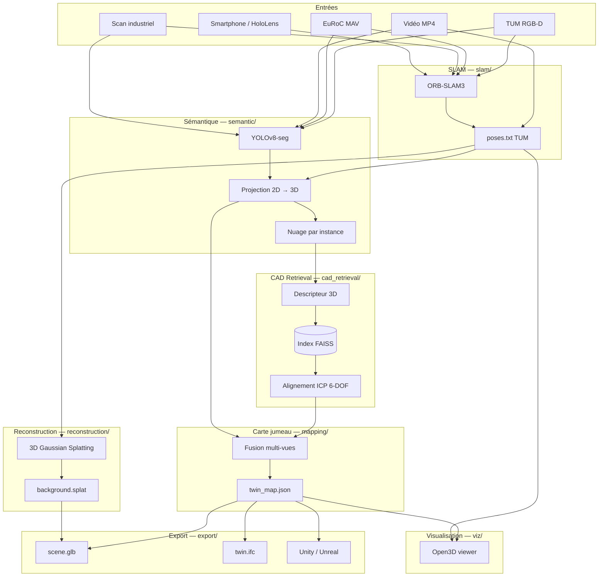
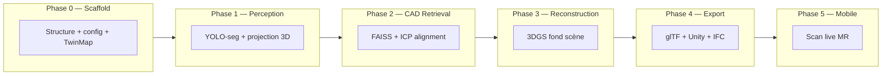
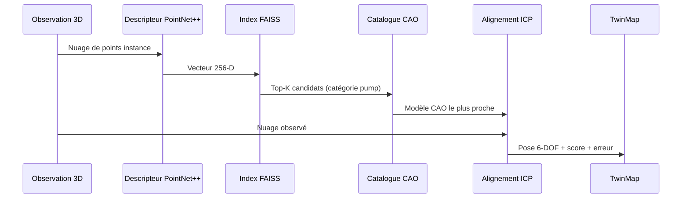
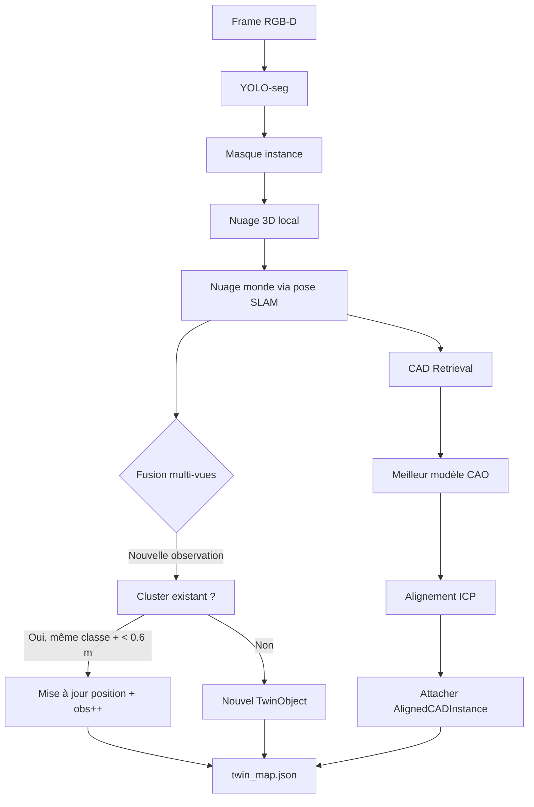
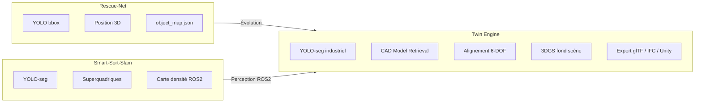

# Architecture — Twin Engine

## Vision

Twin Engine transforme un parcours caméra (smartphone, casque MR, robot) en un **jumeau numérique industriel structuré** : un graphe d'objets sémantiques enrichi de modèles CAO alignés en 6-DOF, complété par une reconstruction photoréaliste du fond de scène.

Contrairement au SLAM classique (nuage de points dense) ou à l'Object SLAM basique (bounding boxes), Twin Engine produit des **actifs CAO réutilisables** — exploitables directement en maintenance, simulation et BIM.

## Vue d'ensemble



## Pipeline par phase



## Modules

### `slam/` — Estimation de pose

| Élément | Détail |
|---------|--------|
| Backend | ORB-SLAM3 (C++) |
| Modes | RGB-D (TUM), monocular (EuRoC), scan industriel |
| Sortie | `poses.txt` format TUM |
| Bypass | `--identity-poses` pour tests sans SLAM |

La trajectoire caméra est la colonne vertébrale du pipeline : elle permet de fusionner les observations multi-vues et d'ancrer les modèles CAO dans un repère monde cohérent.

**Phase 2+** : support VIO (visual-inertial) pour scans handheld smartphone / HoloLens.

### `semantic/` — Détection et géolocalisation

| Fichier | Rôle | Statut |
|---------|------|--------|
| `detector.py` | YOLOv8-seg, mapping COCO → classes industrielles | Phase 1 |
| `projector.py` | Back-projection RGB-D, nuage par instance | Phase 1 |
| `dataset_loaders.py` | Itérateurs TUM, EuRoC, vidéo, scan | Phase 1 |
| `types.py` | BBox2D, SegmentedInstance, CameraPose | ✅ |

**Projection RGB-D** : pour chaque instance segmentée, extraction du nuage de points 3D via la depth map masquée → transformée monde via pose SLAM.

**Projection mono** : profondeur estimée par heuristique `(fy × hauteur_objet) / hauteur_bbox_px` (échelle relative, calibrable).

### `cad_retrieval/` — Recherche et alignement CAO

Cœur différenciant de Twin Engine. Quand YOLO détecte `hydraulic_pump` :



| Fichier | Rôle | Statut |
|---------|------|--------|
| `descriptor.py` | PointNet++ / DGCNN / FPFH → vecteur 256-D | Phase 2 |
| `index.py` | Construction et requête index FAISS | Phase 2 |
| `aligner.py` | ICP point-to-point / Procrustes | Phase 2 |
| `catalog.py` | Chargement catalogue depuis `config/cad/catalog.yaml` | Phase 2 |
| `types.py` | CADModelRef, AlignedCADInstance, Pose6DOF | ✅ |

**Config** : `config/cad/catalog.yaml` — catégories, chemins `.glb`, paramètres retrieval et ICP.

### `mapping/` — Carte jumeau numérique

| Fichier | Rôle | Statut |
|---------|------|--------|
| `twin_map.py` | TwinObject, TwinMap, sérialisation JSON | ✅ |
| `fusion.py` | Cluster spatial multi-vues (classe + distance) | Phase 1 |

Chaque `TwinObject` agrège :
- Label sémantique + position 3D + confiance
- Observations multi-vues (fusion)
- Instance CAO alignée (optionnelle, Phase 2+)

**Métrique clé** : `cad_coverage` — fraction d'objets avec un modèle CAO aligné.

### `reconstruction/` — Fond de scène (Phase 3+)

Reconstruction **NeRF sémantique / 3D Gaussian Splatting** pour tout ce qui n'est pas couvert par le catalogue CAO : murs, sols, tuyauteries non répertoriées, structures architecturales.

| Étape | Détail |
|-------|--------|
| Masquage | Exclure les régions déjà couvertes par des instances CAO |
| Entraînement | 3DGS sur trajectoire caméra (nerfstudio / gsplat) |
| Export | `background.splat` fusionné avec les modèles CAO |

### `export/` — Formats de sortie (Phase 4+)

| Format | Usage | Priorité |
|--------|-------|----------|
| **JSON** (`twin_map.json`) | Graphe sémantique, API, sync | P1 |
| **glTF 2.0** (`scene.glb`) | Viewer web, Unity, Unreal | P4 |
| **IFC 4.3** (`twin.ifc`) | BIM, maintenance industrielle | P4 |
| **Unity package** | Formation, simulation | P4 |
| **3DGS** (`background.splat`) | Rendu photoréaliste | P3 |

Config : `config/export/formats.yaml`

### `viz/` — Visualisation

- Trajectoire caméra (lignes)
- Objets sémantiques (sphères colorées par classe)
- Modèles CAO alignés (mesh wireframe)
- Export PLY headless

Référence : `Rescue-Net/viz/viewer.py`

## Modèle de données

### TwinObject

```python
TwinObject:
  id: str                    # UUID
  class_name: str            # hydraulic_pump, electric_motor, ...
  position: [x, y, z]        # monde (m)
  confidence: float
  observations: int          # vues concordantes
  last_seen_ts: float
  agent_id: str              # "scanner_0"
  cad: AlignedCADInstance     # optionnel (Phase 2+)
```

### AlignedCADInstance

```python
AlignedCADInstance:
  cad_model_id: str          # pump_hydraulic_01
  cad_category: str          # pump
  cad_file: str              # pump/hydraulic_01.glb
  pose:
    position: [x, y, z]
    quaternion: [qx, qy, qz, qw]
  retrieval_score: float     # similarité FAISS [0, 1]
  alignment_error_m: float   # erreur ICP (m)
  semantic_class: str
  observations: int
```

Taille typique : **~500–800 octets/objet avec CAD** → carte < 200 Ko pour 50–200 objets.

## Configurations

| Fichier | Contenu |
|---------|---------|
| `config/datasets.yaml` | Chemins datasets locaux |
| `config/semantic/classes.yaml` | 8 classes MVP, seuils, couleurs, fusion |
| `config/slam/tum_rgbd.yaml` | Intrinsèques Freiburg1 + binaires ORB |
| `config/slam/euroc_mono.yaml` | Intrinsèques EuRoC |
| `config/cad/catalog.yaml` | Catalogue CAO, retrieval, ICP |
| `config/export/formats.yaml` | Formats activés par phase |

## Flux de données



## Choix techniques

| Choix | Justification | Limite |
|-------|---------------|--------|
| YOLO-seg COCO pretrained (Phase 1) | Zero-shot, rapide à intégrer | Proxy grossier — fine-tune requis |
| ORB-SLAM3 | Standard académique, RGB-D + mono | Build C++ lourd |
| PointNet++ + FAISS | Retrieval 3D éprouvé, scalable | Nécessite catalogue CAO annoté |
| ICP pour alignement | Simple, précis < 5 cm | Échoue si retrieval incorrect |
| 3DGS pour fond | Rendu photoréaliste, rapide | Coût GPU entraînement |
| JSON + glTF | Interop maximale | IFC complexe (Phase 4) |
| Open3D vs Unity | Offline, sans infra lourde | Pas de rendu MR temps réel (Phase 5) |

## Comparaison avec les projets voisins



| Capacité | Rescue-Net | Smart-Sort-Slam | Twin Engine |
|----------|-----------|-----------------|-------------|
| SLAM | ORB-SLAM3 | RGB-D odometry | ORB-SLAM3 |
| Détection | YOLO bbox | YOLO-seg | YOLO-seg industriel |
| Géométrie objet | Point 3D | Superquadrique | **Modèle CAO réel** |
| Retrieval | — | — | **FAISS + PointNet++** |
| Fond scène | — | Nuage de points | **3D Gaussian Splatting** |
| Export | JSON | ROS2 topics | **JSON + glTF + IFC** |
| Domaine | Secours | Tri déchets | **Jumeau numérique industriel** |

## Métriques MVP

| Composant | Métrique | Cible |
|-----------|----------|-------|
| SLAM | ATE vs GT TUM | < 5 cm |
| Segmentation | mAP@50 (industriel fine-tuné) | > 0.65 |
| CAD Retrieval | Top-1 accuracy (catégorie correcte) | > 0.80 |
| Alignement ICP | Erreur RMS | < 5 cm |
| CAD Coverage | % objets avec modèle aligné | > 70 % |
| Export glTF | Cohérence pose vs twin_map.json | < 1 cm |
| Pipeline complet | Temps scan 500 m² | < 15 min |

## Dépendances par phase

| Phase | Packages Python | Système |
|-------|----------------|---------|
| P0 | pyyaml, pytest | — |
| P1 | ultralytics, open3d, opencv | ORB-SLAM3 (optionnel) |
| P2 | torch, faiss-cpu, trimesh | GPU recommandé |
| P3 | nerfstudio, gsplat | GPU requis |
| P4 | pygltflib | Unity/Unreal (optionnel) |
| P5 | — | HoloLens SDK / ARCore |

Les dépendances Phase 2+ sont commentées dans `requirements.txt`.

## Risques et mitigations

| Risque | Impact | Mitigation |
|--------|--------|------------|
| Proxy COCO inadapté industrie | Faible recall Phase 1 | Fine-tune YOLO-seg sur dataset annoté |
| Catalogue CAO incomplet | Objets sans modèle | Fallback superquadrique (Smart-Sort-Slam) |
| ICP diverge | Pose CAO incorrecte | Seuil retrieval_score + validation multi-vues |
| 3DGS lent sur mobile | Scan live impossible Phase 5 | Reconstruction offline post-scan |
| Échelle mono ambiguë | Modèles mal dimensionnés | RGB-D prioritaire, calibration ARKit/LiDAR |

## Prochaines étapes

1. **Phase 1** — Porter `semantic/detector.py` et `projector.py` depuis Rescue-Net, adapter aux classes industrielles
2. **Phase 2** — Peupler `assets/cad_models/` avec 50 modèles `.glb`, implémenter `cad_retrieval/index.py`
3. **Phase 3** — Intégrer nerfstudio pour le fond de scène
4. **Phase 4** — Export glTF avec pygltflib
5. **Phase 5** — App mobile ou intégration HoloLens
